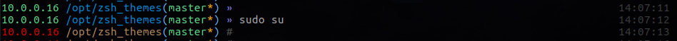

## Description
These are a couple of existing zsh themes that I tweaked to fit my needs. I found myself doing an ifconfig quite a bit and decided it would be nice if I could incorporate the internal IP address that I was assigned.

The IP address will show the hard wired IP you were assigned. If there is no hard wired IP, it will show the wireless IP. If there is no wireless, it will show 127.0.0.1.

The IP is updated each time you press enter.

## Output
custom-af-magic (includes light grey timestamp on the right)



custom-agnoster


## Requirements
oh-my-zsh. You can get it here.
```
https://github.com/robbyrussell/oh-my-zsh
```

## Install
Visit the robbyrussel/oh-my-zsh repo for a more detailed installation guide. But here's a short and sweet version:
1. Copy the theme to `~/.oh-my-zsh/themes`
2. Edit your `~/.zshrc` file and point the ZSH_THEME variable to the custom theme
3. Open a new terminal window
